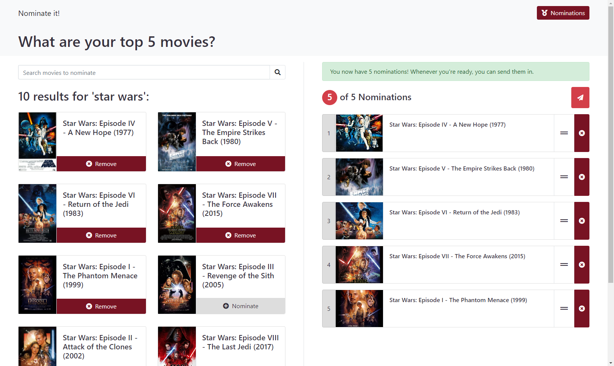
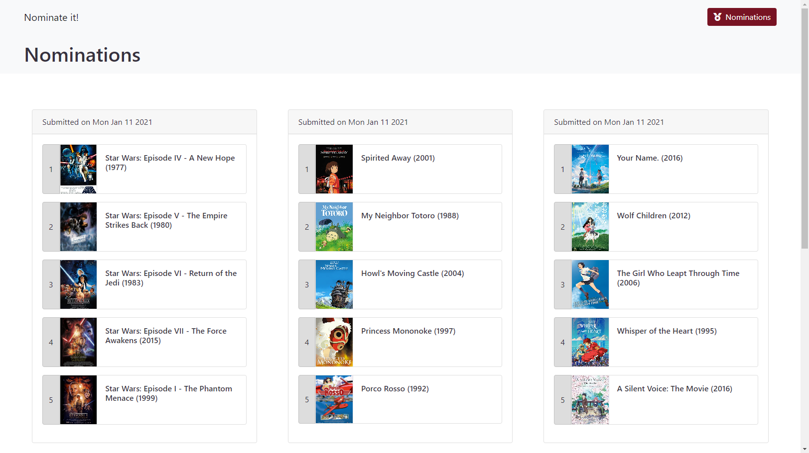

# Nominate it!



:link: [Visit Nominate It](https://nominate-it.herokuapp.com/)

Nominate is a website for sending in your top 5 movies.

Add movies to your nomination list by selecting a result from the search. Your submission will appear on the 'Nominations' page. Browse through the lists to see what other people nominated as their top 5's.

All movie data is retrieved with the [OMDb API](http://www.omdbapi.com/).



## Local Install

Run the following commands to get yourself up and running:

```
npm install
cd client
npm install
```

Once you've got everything installed,

1. [Grab an API key from OMDb](http://www.omdbapi.com/apikey.aspx) (You won't be able to see search results otherwise)
2. Set your API key as an environment variable by running: `export REACT_APP_API_KEY=<Your API Key>`
3. Test it by running a search. If your search results are there, you're all good to go!
4. Run `npm start` in the root directory _and_ the `client` directory to see the application in action.

### Optional

If you want to test out the database, run `node seeders`.

This will insert dummy data into the database. If the insert was successful, you'll be able to see it under the 'Nominations' page.

## Built with

### Front-End

- [React](https://reactjs.org/)
- [Bootstrap](https://getbootstrap.com/)
- [FontAwesome](https://fontawesome.com/)

### Back-End

- [Express](https://expressjs.com/)
- [Mongoose](https://mongoosejs.com/)
- [Axios](https://www.npmjs.com/package/axios)

## License

This project is licensed under the **MIT License**.

This project was bootstrapped with [Create React App](https://github.com/facebook/create-react-app).
